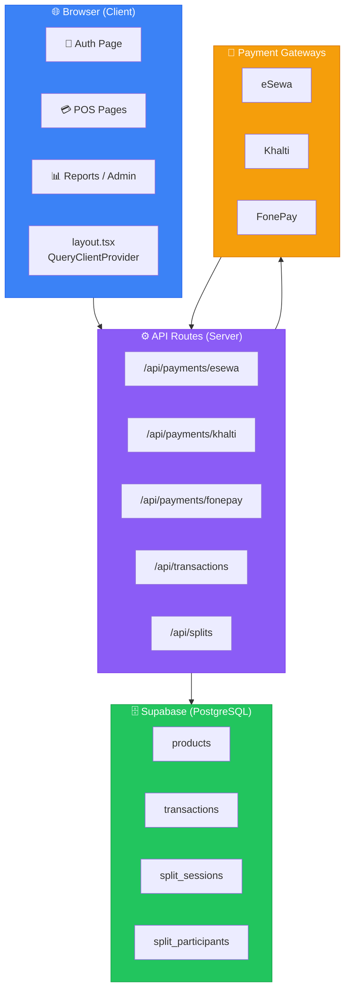
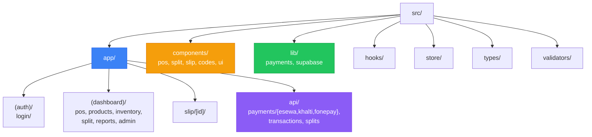
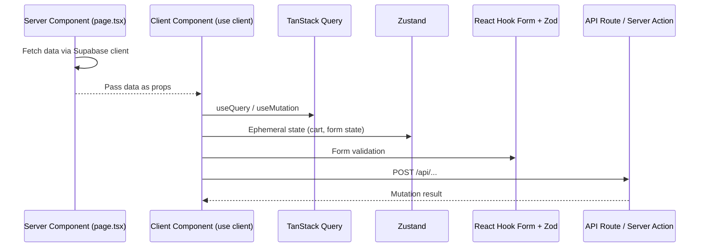

# Architecture

> A high-level map of the system: modules, services, how data moves between them. Not implementation detail — the shape of the thing.

---

## 🗺️ System Overview



---

## 📂 Folder Architecture



```
src/
├── app/                    # Next.js App Router pages & API routes
│   ├── (auth)/            # Route group: authentication pages
│   │   └── login/
│   ├── (dashboard)/       # Route group: authenticated pages
│   │   ├── pos/
│   │   ├── products/
│   │   ├── inventory/
│   │   ├── split/
│   │   ├── reports/
│   │   └── admin/
│   ├── slip/[id]/         # Dynamic route: transaction slip PDF
│   └── api/               # API routes (serverless functions)
│       ├── payments/
│       │   ├── esewa/
│       │   ├── khalti/
│       │   └── fonepay/
│       ├── transactions/
│       └── splits/
├── components/
│   ├── pos/               # POS-specific UI components
│   ├── split/             # Split-bill components
│   ├── slip/              # Slip/receipt components
│   ├── codes/             # QR/barcode components
│   └── ui/                # Shadcn UI base components
├── lib/
│   ├── payments/          # Payment gateway helpers & types
│   └── supabase/          # Supabase client & helpers
├── hooks/                 # Custom React hooks
├── store/                 # Zustand stores
├── types/                 # TypeScript type definitions
└── validators/            # Zod validation schemas
```

---

## 🔄 Data Flow Pattern



```
Server Component (page.tsx)
  ├── Fetch data directly (server-side) via Supabase client
  ├── Pass data to Client Components as props
  └── Client Component (use client)
       ├── TanStack Query for caching/refetching
       ├── Zustand for ephemeral state (cart, form state)
       ├── React Hook Form + Zod for form handling
       └── Server Actions or API routes for mutations
```

---

## 🏗️ Key Patterns

| # | Pattern | Description |
|---|---------|-------------|
| 1 | **Server Components** | Data fetching and SEO handled server-side by default |
| 2 | **Client Components** | Interactivity via `"use client"` directive |
| 3 | **Route Groups** | `(auth)` and `(dashboard)` share layouts without affecting URL |
| 4 | **API Routes** | Under `app/api/` for payment gateway webhooks and server actions |
| 5 | **Dynamic Routes** | `slip/[id]` for unique transaction receipt URLs |
| 6 | **Shared Zod Schemas** | Used by both RHF forms and API validation |
| 7 | **RLS on All Tables** | Server uses service role, client uses anon key |

---

> 💡 **Why this matters**: Without a map, every session starts by guessing the terrain. With one, the AI can reason about impact before it writes a single line.