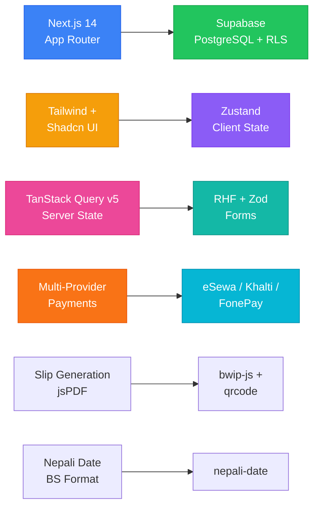

# Decisions Log (ADRs)

> Every meaningful decision the AI makes while changing code — and the reasoning behind it. Code shows *what* changed. This file shows *why*.

---

## 📊 Decision Summary



---

## ADR-001: Next.js 14 App Router Architecture

| | |
|---|---|
| **Status** | ✅ Accepted |
| **Date** | 2026-09-18 |
| **Deciders** | Project scaffold |

**Context**: Need a modern, performant React framework with SSR/SSG support for ScanPay.

**Decision**: Use Next.js 14 with App Router (`src/app/` convention), TypeScript strict mode.

**Consequences**:
- Server Components by default
- API routes under `src/app/api/`
- Client components need `"use client"` directive

---

## ADR-002: Tailwind CSS + Shadcn UI for Styling

| | |
|---|---|
| **Status** | ✅ Accepted |
| **Date** | 2026-09-18 |

**Context**: Need consistent, accessible UI components with custom theming.

**Decision**: Tailwind CSS for utility-first styling; Shadcn UI for component primitives (init with default theme).

**Consequences**: Custom theme variables in `tailwind.config.ts`; shadcn components require `@radix-ui` primitives.

---

## ADR-003: Zustand for Client State

| | |
|---|---|
| **Status** | ✅ Accepted |
| **Date** | 2026-09-18 |

**Context**: Need lightweight global client state for POS session, cart, and payment flow.

**Decision**: Zustand over Redux or Context API — minimal boilerplate, small bundle size.

**Consequences**: No devtools by default (can add); no middleware overhead.

---

## ADR-004: TanStack Query v5 for Server State

| | |
|---|---|
| **Status** | ✅ Accepted |
| **Date** | 2026-09-18 |

**Context**: Need caching, refetching, and optimistic updates for API data (products, transactions, etc.).

**Decision**: TanStack Query v5 (`@tanstack/react-query`).

**Consequences**: Requires `QueryClientProvider` in layout; API routes should use server components where possible.

---

## ADR-005: React Hook Form + Zod for Forms

| | |
|---|---|
| **Status** | ✅ Accepted |
| **Date** | 2026-09-18 |

**Context**: Need form validation for login, product forms, split amounts, payment details.

**Decision**: React Hook Form (RHF) + Zod for schema validation and type inference.

**Consequences**: Zod schemas shared between client validation and API validation; RHF `zodResolver` integration.

---

## ADR-006: Payment Gateway Multi-Provider Architecture

| | |
|---|---|
| **Status** | ✅ Accepted |
| **Date** | 2026-09-18 |

**Context**: Nepal has multiple payment gateways (eSewa, Khalti, FonePay); need unified integration.

**Decision**: Separate API routes under `src/app/api/payments/{provider}/`; shared types and helper functions in `src/lib/payments/`.

**Consequences**: Each provider has initiate and verify endpoints; provider-specific SDKs/packages (qrcode, bwip-js, zxing-wasm) used per provider.

---

## ADR-007: Slip/Receipt Generation with jsPDF

| | |
|---|---|
| **Status** | ✅ Accepted |
| **Date** | 2026-09-18 |

**Context**: Users need printable transaction slips/receipts.

**Decision**: Use `jspdf` + `jspdf-autotable` for PDF generation; slip page at `src/app/slip/[id]/`.

**Consequences**: PDF generated client-side; barcode generation via `bwip-js` and QR via `qrcode`; ZXing for scanning.

---

## ADR-008: Nepali Date Support

| | |
|---|---|
| **Status** | ✅ Accepted |
| **Date** | 2026-09-18 |

**Context**: Nepal uses Bikram Sambat (BS) calendar; all dates in UI should show BS dates.

**Decision**: Use `nepali-date` package for BS date conversion.

**Consequences**: All display dates formatted in BS; storage dates in ISO/AD format in DB.

---

## ADR-009: Supabase as Backend

| | |
|---|---|
| **Status** | ✅ Accepted |
| **Date** | 2026-09-18 |

**Context**: Need auth, database, and real-time capabilities.

**Decision**: Supabase with PostgreSQL; RLS enabled on all tables.

**Consequences**: Row-level security policies must be carefully designed; service role key only used in server contexts.

---

## 📝 How to Add a New ADR

```markdown
## ADR-XXX: <Title>
| | |
|---|---|
| **Status** | ⏳ Proposed / ✅ Accepted / ❌ Rejected |
| **Date** | YYYY-MM-DD |

**Context**: <What problem are we solving?>
**Decision**: <What did we choose?>
**Consequences**: <What are the tradeoffs?>
```

> 💡 **Why this matters**: Six months later, that "why" is the only thing that saves you from re-litigating settled arguments.