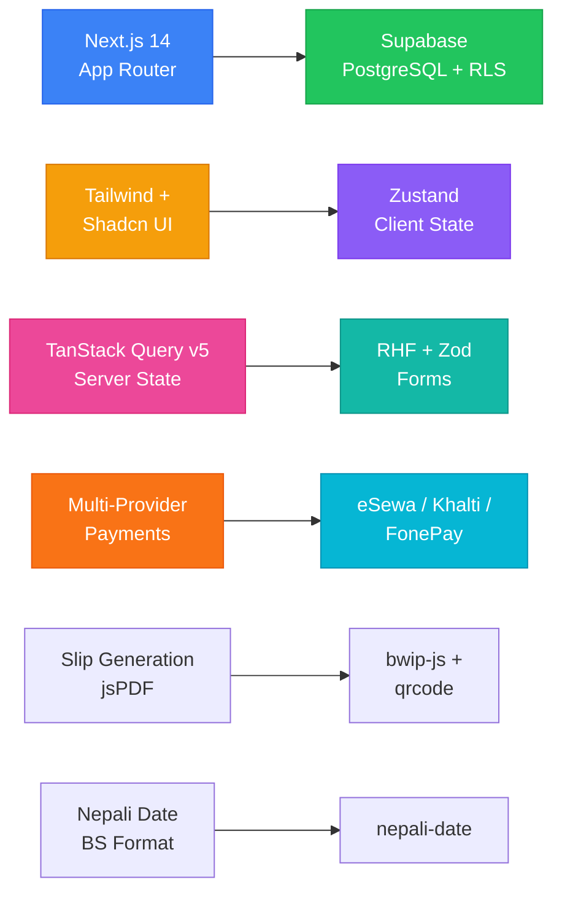

# Decisions Log (ADRs)

> Every meaningful decision the AI makes while changing code — and the reasoning behind it. Code shows *what* changed. This file shows *why*.

---

## 📊 Decision Summary



---

## ADR-001: Next.js 14 App Router Architecture

| | |
|---|---|
| **Status** | ✅ Accepted |
| **Date** | 2026-09-18 |
| **Deciders** | Project scaffold |

**Context**: Need a modern, performant React framework with SSR/SSG support for ScanPay.

**Decision**: Use Next.js 14 with App Router (`src/app/` convention), TypeScript strict mode.

**Consequences**:
- Server Components by default
- API routes under `src/app/api/`
- Client components need `"use client"` directive

---

## ADR-002: Tailwind CSS + Shadcn UI for Styling

| | |
|---|---|
| **Status** | ✅ Accepted |
| **Date** | 2026-09-18 |

**Context**: Need consistent, accessible UI components with custom theming.

**Decision**: Tailwind CSS for utility-first styling; Shadcn UI for component primitives (init with default theme).

**Consequences**: Custom theme variables in `tailwind.config.ts`; shadcn components require `@radix-ui` primitives.

---

## ADR-003: Zustand for Client State

| | |
|---|---|
| **Status** | ✅ Accepted |
| **Date** | 2026-09-18 |

**Context**: Need lightweight global client state for POS session, cart, and payment flow.

**Decision**: Zustand over Redux or Context API — minimal boilerplate, small bundle size.

**Consequences**: No devtools by default (can add); no middleware overhead.

---

## ADR-004: TanStack Query v5 for Server State

| | |
|---|---|
| **Status** | ✅ Accepted |
| **Date** | 2026-09-18 |

**Context**: Need caching, refetching, and optimistic updates for API data (products, transactions, etc.).

**Decision**: TanStack Query v5 (`@tanstack/react-query`).

**Consequences**: Requires `QueryClientProvider` in layout; API routes should use server components where possible.

---

## ADR-005: React Hook Form + Zod for Forms

| | |
|---|---|
| **Status** | ✅ Accepted |
| **Date** | 2026-09-18 |

**Context**: Need form validation for login, product forms, split amounts, payment details.

**Decision**: React Hook Form (RHF) + Zod for schema validation and type inference.

**Consequences**: Zod schemas shared between client validation and API validation; RHF `zodResolver` integration.

---

## ADR-006: Payment Gateway Multi-Provider Architecture

| | |
|---|---|
| **Status** | ✅ Accepted |
| **Date** | 2026-09-18 |

**Context**: Nepal has multiple payment gateways (eSewa, Khalti, FonePay); need unified integration.

**Decision**: Separate API routes under `src/app/api/payments/{provider}/`; shared types and helper functions in `src/lib/payments/`.

**Consequences**: Each provider has initiate and verify endpoints; provider-specific SDKs/packages (qrcode, bwip-js, zxing-wasm) used per provider.

---

## ADR-007: Slip/Receipt Generation with jsPDF

| | |
|---|---|
| **Status** | ✅ Accepted |
| **Date** | 2026-09-18 |

**Context**: Users need printable transaction slips/receipts.

**Decision**: Use `jspdf` + `jspdf-autotable` for PDF generation; slip page at `src/app/slip/[id]/`.

**Consequences**: PDF generated client-side; barcode generation via `bwip-js` and QR via `qrcode`; ZXing for scanning.

---

## ADR-008: Nepali Date Support

| | |
|---|---|
| **Status** | ✅ Accepted |
| **Date** | 2026-09-18 |

**Context**: Nepal uses Bikram Sambat (BS) calendar; all dates in UI should show BS dates.

**Decision**: Use `nepali-date` package for BS date conversion.

**Consequences**: All display dates formatted in BS; storage dates in ISO/AD format in DB.

---

## ADR-009: Supabase as Backend

| | |
|---|---|
| **Status** | ✅ Accepted |
| **Date** | 2026-09-18 |

**Context**: Need auth, database, and real-time capabilities.

**Decision**: Supabase with PostgreSQL; RLS enabled on all tables.

**Consequences**: Row-level security policies must be carefully designed; service role key only used in server contexts.

---

## ADR-010: @supabase/ssr for Cookie-Based Auth

| | |
|---|---|
| **Status** | ✅ Accepted |
| **Date** | 2026-09-19 |

**Context**: Next.js 14 App Router requires cookie-based session handling for Supabase auth; the old `@supabase/auth-helpers-nextjs` package is deprecated.

**Decision**: Use `@supabase/ssr@0.5.2` for server-side client creation with cookie handling.

**Consequences**: Server components and middleware can access the session via cookies; middleware protects routes by checking session validity.

---

## ADR-011: Code Engine — zxing-wasm/reader Subpath + Dynamic Import

| | |
|---|---|
| **Status** | ✅ Accepted |
| **Date** | 2026-09-20 |

**Context**: BarcodeScanner needs WASM-based barcode/QR reading in the browser. `zxing-wasm` ships three subpaths (`full` ~1.46 MiB, `reader` ~1.04 MiB, `writer` ~636 KiB). The scanner only reads — never writes — so including the full module wastes ~420 KiB. Additionally, WASM and `navigator.mediaDevices` crash during SSR.

**Decision**:
1. Import `readBarcodes` from `zxing-wasm/reader` (not `zxing-wasm`) to pull only the reader WASM binary.
2. Wrap the scanner with `next/dynamic` + `ssr: false` via `DynamicBarcodeScanner.tsx`.
3. Let zxing-wasm's default jsDelivr CDN serve the `.wasm` file (no self-hosting needed at this stage).

**Consequences**: Smaller client bundle. Scanner component is only loadable client-side. Future self-hosting of `.wasm` is possible via `prepareZXingModule` if CDN latency becomes an issue.
### 2026-09-20 — zxing-wasm binary hosting
- Decision: Self-host the .wasm file in `public/` instead of loading from CDN.
- Alternatives considered: CDN loading (simpler but adds network dependency on a critical checkout‑path feature).
- Why: PRD §13 non‑functional requirements target offline resilience and 4G performance; a CDN round‑trip risks both on a spotty connection.

---

## ADR-012: Radix UI Dialog + Product Catalog CRUD with Auto-Code Generation

| | |
|---|---|
| **Status** | ✅ Accepted |
| **Date** | 2026-09-21 |

**Context**: 
1. The product management interface requires modal dialogs for product creation, editing, and delete confirmations with accessible focus traps, overlay animations, and responsive positioning.
2. Products require automatic EAN-13 barcode generation (12 numeric digits with auto check digit via `bwip-js`) and dynamic QR code generation ({id, name, price} JSON) upon creation.
3. PRD §9 specifies fields: `id`, `name`, `name_np`, `price`, `category`, `stock`, `low_stock_threshold`, `vat_applicable`, `barcode`, `qr_data`, `created_at`.

**Decision**:
1. Install `@radix-ui/react-dialog` to power standard Shadcn `Dialog` primitives (`Dialog`, `DialogContent`, `DialogHeader`, `DialogFooter`, `DialogTitle`, `DialogDescription`).
2. Drop unused schema fields (`description`, `cost_price`, `image_url`, `is_active`, `updated_at`) to strictly align with PRD §9.
3. Provide a confirmation modal before destructive deletion to prevent accidental loss of catalog data.
4. Reuse the existing `QRGenerator` with `className` and `hideDownload` props for 80px mini QR rendering on cards and in-modal previews.

**Consequences**: Accessible dialogs project-wide, consistent code generation across POS and product catalog, strict TypeScript validation with React Hook Form + Zod.

---

---

## ADR-013: Inventory Manager with Stock Alerts, Bulk Update, CSV Import/Export

| | |
|---|---|
| **Status** | ✅ Accepted |
| **Date** | 2026-09-22 |

**Context**:
Need a dedicated inventory management page separate from the product catalog. Requirements:
1. Top alert banner when products are at/below `low_stock_threshold` — shows count and lists names
2. Inventory table (desktop) / card list (mobile) with columns: Product name, Category, Current stock, Threshold, Status (OK/LOW/OUT), Quick adjust (+/- buttons + custom input)
3. Quick adjust calls `useUpdateStock` mutation with optimistic update
4. Bulk update modal listing all products with editable stock fields, save all at once
5. CSV export of current inventory (name, name_np, barcode, price, stock, category) via vanilla JS Blob
6. CSV import with file input, PapaParse preview table with validation, Supabase upsert on barcode conflict

**Decision**:
1. Created `src/hooks/products/useInventory.ts` with `useInventory` (query sorted by stock ASC), `useUpdateStock` (optimistic single update), `useBulkUpdateStock` (array upsert), and `getStockStatus` helper
2. Built modular components: `InventoryAlertBanner`, `InventoryTable`, `InventoryCard`, `BulkUpdateModal`, `CSVExportButton`, `CSVImport`
3. Used PapaParse for robust CSV parsing (handles quoted fields, commas, newlines)
4. Inventory page uses responsive pattern: table on `md:`+, cards on mobile
5. Empty state shows green checkmark when no low-stock items
6. Loading skeletons: `InventoryTableSkeleton` (5 rows), `ProductCardSkeleton` (reused by products page)

**Consequences**: Reusable inventory hooks and components; CSV import/export without heavy dependencies; optimistic updates for snappy UX; consistent with existing product catalog patterns.

---

## ADR-014: Product & Inventory Responsive QA Polish (Day 11)

| | |
|---|---|
| **Status** | ✅ Accepted |
| **Date** | 2026-09-22 |

**Context**:
Polish pass over Days 7–10 work to ensure production-quality responsive behavior across breakpoints (375px iPhone SE, 414px, 768px iPad, 1280px desktop).

**Decision**:
1. **Loading skeletons**: Extracted `ProductCardSkeleton` (matches product card dimensions) and `InventoryTableSkeleton` (5 rows) — both use Shadcn `Skeleton` component
2. **Text truncation**: Added `truncate` + `max-w-[150px]` to product name, name_np, barcode on cards and table cells to prevent overflow at 414px
3. **Table → cards**: Inventory page already uses `hidden md:block` (table) / `md:hidden` (cards) — verified no horizontal scroll on tablet
4. **Modal viewport overflow**: Added `max-h-[90vh] overflow-y-auto` to `DialogContent` in `ProductModal`, `DeleteProductDialog`, `ProductImageModal` — prevents overflow on iPhone SE (375px)
5. **Empty states**: Products page already had illustration + "No products found" + CTA; Inventory page added green checkmark + "All stock levels are healthy" when no low-stock items
6. **Error states**: Products & Inventory error banners now include Retry button calling `refetch()`

**Consequences**: Consistent skeleton/empty/error patterns across product and inventory pages; all modals fit mobile viewport; no text overflow on narrow screens; table never causes horizontal scroll.

---

## ADR-015: POS Cart State & Product Search (Day 12)

| | |
|---|---|
| **Status** | ✅ Accepted |
| **Date** | 2026-09-23 |

**Context**:
Need a POS screen with cart state management and product search for fast checkout. Requirements:
1. Cart state persisted across sessions (localStorage) with full Product objects, quantity, cashier note
2. Product search by name (fuzzy/ILIKE) or barcode (exact) with debounced input and dropdown results
3. Responsive POS layout: mobile-first with sticky search, desktop split view with always-visible cart panel
4. Toast notifications for add-to-cart feedback

**Decision**:
1. **Cart Store**: `src/store/cartStore.ts` — Zustand with `persist` middleware (`scanpay-cart` key). `CartItem = { product: Product, quantity }` stores full Product for price/name access without re-fetching. Actions: `addItem(product)` (increments qty if exists), `removeItem(id)`, `updateQuantity(id, qty)` (removes if ≤0), `clearCart()`, `setCashierNote(note)`. Derived selectors: `getSubtotal()`, `getItemCount()`.
2. **Search Hook**: `useProductSearch(query)` in `useProducts.ts` — TanStack Query with Supabase `.or('name.ilike.%query%,barcode.eq.query')` limited to 6 results. Key: `['products', 'search', query]`.
3. **Debounce Hook**: `useDebounce<T>(value, delay)` — generic, reusable for any debounced input.
4. **Toast System**: `useToast.tsx` — Context + Provider, `addToast(message, type)`, auto-dismiss 3s, Framer Motion animations, accessible dismiss button.
5. **ProductSearch Component**: Controlled input with Search icon, 300ms debounce, dropdown with keyboard navigation (↑/↓/Enter/Esc), results show name, name_np, price, stock badge (color-coded). Click/Enter → `onProductSelect(product)` → clear input.
6. **Responsive POS Layout**: Mobile (<1024px) — sticky search → dropdown → ProductGrid (quick add 12 products) → sticky cart → payment → actions. Cart badge in header. Desktop (≥1024px) — CSS Grid 60/40 split: left (sticky search + ProductGrid), right (sticky cart + payment + QR/barcode + actions).
7. **CartDisplay Update**: Uses `item.product.id`, `item.product.name`, `item.product.price` from new `CartItem` shape.

**Consequences**: Fast checkout UX with persistent cart, debounced search with keyboard accessibility, responsive layout works on all breakpoints, toast feedback for actions. Cart state survives page refresh. Search reuses existing Supabase query patterns. No new dependencies.

---

## 📝 How to Add a New ADR

```markdown
## ADR-XXX: <Title>
| | |
|---|---|
| **Status** | ⏳ Proposed / ✅ Accepted / ❌ Rejected |
| **Date** | YYYY-MM-DD |

**Context**: <What problem are we solving?>
**Decision**: <What did we choose?>
**Consequences**: <What are the tradeoffs?>
```

> 💡 **Why this matters**: Six months later, that "why" is the only thing that saves you from re-litigating settled arguments.