# Flows

> Document how execution actually travels — between files, functions, and modules. Bugs live in the gaps between files.

---

## 🗺️ Flow Index

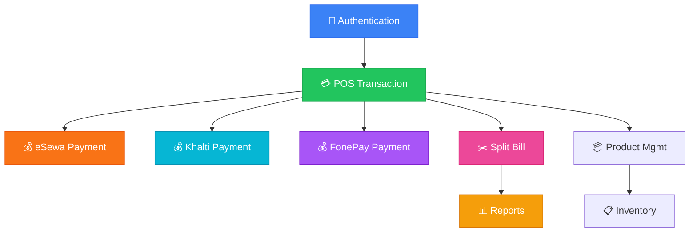

---

## 1. User Authentication Flow

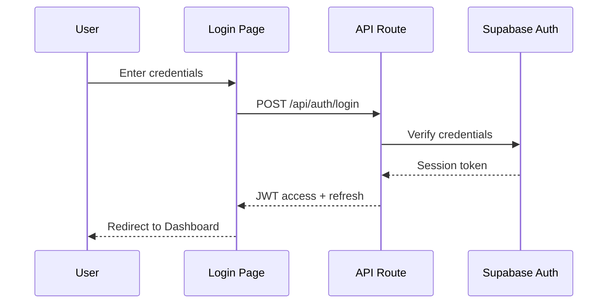

```
[Login Page] → [Credentials] → [API Route: /api/auth/...] → [Supabase Auth] → [Session Token] → [Dashboard Layout]
```

---

## 2. POS — Create Transaction Flow

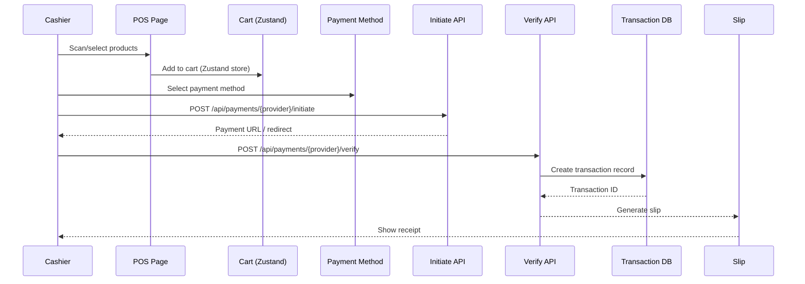

```
[POS Page] → [Add Products] → [Cart (Zustand Store)] → [Select Payment Method] → [Initiate Payment] → [Verify Payment] → [Create Transaction] → [Generate Slip]
```

---

## 3. eSewa Payment Flow

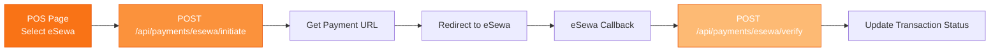

---

## 4. Khalti Payment Flow

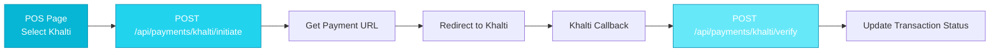

---

## 5. FonePay Payment Flow

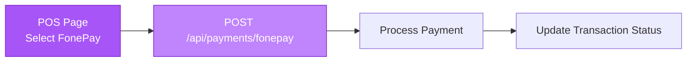

---

## 6. Split Bill Flow

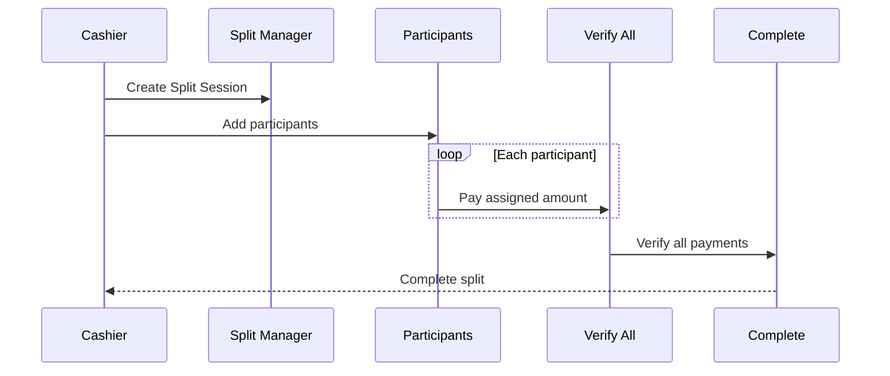

---

## 7. Report Generation Flow

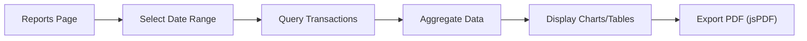

---

## 8. Product Management Flow

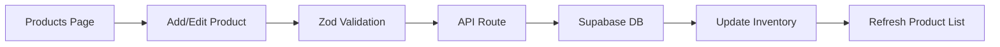

---

## 9. Inventory Flow

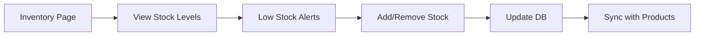

---

> 💡 **Why this matters**: Bugs live in the gaps between files. If you can't see the flow, you can't see where it breaks — and neither can the AI.

---

## 10. Cart UI + Scanner Integration Flow (Days 14–15)

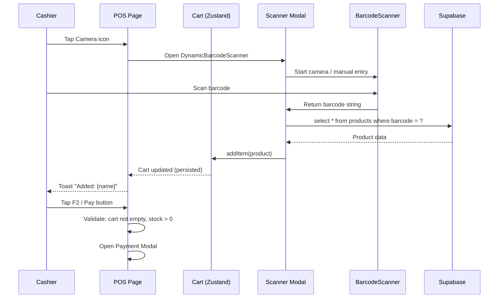

```
[POS Page] → [Camera Button] → [Scanner Modal] → [BarcodeScanner] → [Supabase Lookup] → [Cart Store] → [Toast] → [F2/Pay] → [Validation] → [Payment Modal]
```

---

## 11. Bill Preview + Payment Modal Flow (Days 16–17)

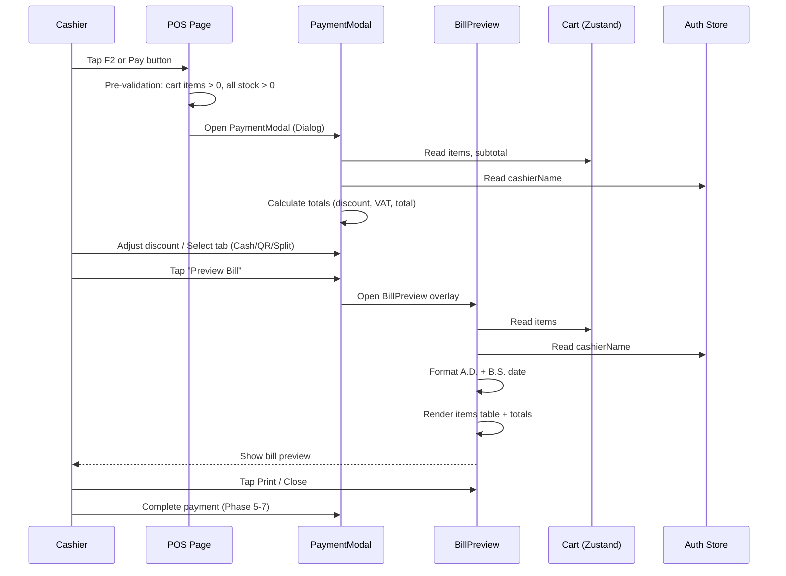

```
[POS Page] → [F2/Pay] → [Pre-validation] → [PaymentModal] → [Cart + Auth Store] → [Totals Calc] → [Tab Selection] → [Preview Bill] → [BillPreview] → [Cart + Auth] → [Date Formatting] → [Render Bill] → [Print/Close] → [Payment Completion]
```

---

## 12. Cart Totals Calculation Flow (Shared)

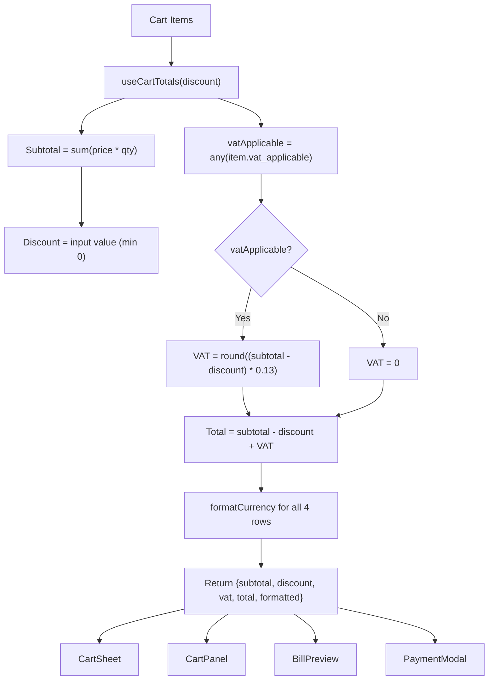

```
[Cart Items] → [useCartTotals] → [Subtotal + VAT Applicable] → [Discount] → [VAT Calc] → [Total] → [Format] → [Return] → [CartSheet, CartPanel, BillPreview, PaymentModal]
```