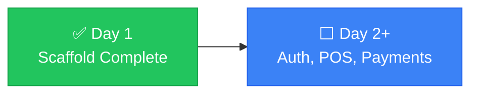

# Handover

> Write context incrementally, in a file the AI reads at the start of every session. Not a dump of everything — a living record of where things stand right now.

---

## 📌 Current State

| | |
|---|---|
| **Project** | ScanPay — Nepal payment gateway integration platform |
| **Framework** | Next.js 14 (App Router, TypeScript strict mode) |
| **Status** | ✅ Day 1 complete — scaffold + CI pipeline passing |
| **Last commit** | `e48483d` on `main`, pushed to `origin/main` |
| **CI** | `tsc --noEmit` ✅ · `next lint` ✅ · `next build` ✅ |

---

## ✅ Completed (Day 1)

- [x] Next.js 14 project scaffolded with App Router
- [x] TypeScript strict mode configured
- [x] Tailwind CSS + Shadcn UI theme initialized (custom breakpoints: sm 414px, md 640px, lg 1024px, xl 1280px)
- [x] Folder structure created per specification
- [x] Config files: package.json, tsconfig.json, next.config.js, tailwind.config.ts, postcss.config.mjs, .eslintrc.js
- [x] `.env.local.example` with all 12 required environment variables
- [x] `.gitignore` configured (excludes `.env.local`, `.env*.local`, `node_modules`, `.next`, `*.tsbuildinfo`)
- [x] CI pipeline (`.github/workflows/ci.yml`) — typecheck, lint, build (verified passing locally)
- [x] `docs/ai-collab/` folder with 8 documentation files (README, HANDOVER, DECISIONS, FLOW, ARCHITECTURE, CONSTRAINTS, TEST_CHECKLIST, ROLLBACK)
- [x] `docs/supabase-setup.md` — Supabase project + schema + RLS verification guide
- [x] `project_docs.md` — Day 1 documentation at repo root
- [x] Dependencies installed (518 packages, lockfile in sync)
- [x] Core app files: `layout.tsx`, `page.tsx`, `globals.css`, `query-provider.tsx`
- [x] Supabase client (`src/lib/supabase/client.ts`) + admin client (`src/lib/supabase/admin.ts`)
- [x] Query provider wired into root layout
- [x] Placeholder route pages for all (auth), (dashboard), slip/[id], and API routes
- [x] Placeholder `index.ts` files in all required component folders
- [x] `public/fonts/` folder with manifest
- [x] `npm run typecheck`, `npm run lint`, `npm run build`, `npm run dev` all pass

## ⬜ Not Yet Started

- [ ] Set up Supabase project and run migrations (see `docs/supabase-setup.md`)
- [ ] Implement authentication (login page)
- [ ] Build POS dashboard components
- [ ] Implement payment gateway integrations (eSewa, Khalti, FonePay)
- [ ] Build split-bill feature
- [ ] Implement transaction and slip generation
- [ ] Set up Zustand stores
- [ ] Implement TanStack Query hooks
- [ ] Zod validators for all forms
- [ ] Product, inventory, reports, and admin pages

## 🚫 Blockers

- **None**

## 👣 Next Steps

1. Configure Supabase project and create tables (`products`, `transactions`, `split_sessions`, `split_participants`)
2. Start with authentication flow (login page)
3. Build core POS interface with payment integration

## ❓ Open Questions

- Supabase schema finalization pending PRD review
- Will Shadcn UI be initialized via CLI or manually? (Currently manual placeholder setup)

---

> 💡 **Session handoff ritual**: End every session with a five-line note: what we did, what's left, what to watch out for. Takes 30 seconds. Saves the next session from starting cold.