# Handover

> Write context incrementally, in a file the AI reads at the start of every session. Not a dump of everything — a living record of where things stand right now.

---

## 📌 Current State

```mermaid
graph LR
    DONE1["✅ Day 1<br/>Scaffold"] --> DONE2["✅ Day 2<br/>Auth + Layout"]
    DONE2 --> DONE3["✅ Day 3<br/>Foundation"]
    DONE3 --> DONE4["✅ Days 4-5<br/>Code Engine"]
    DONE4 --> DONE5["✅ Day 6<br/>Scanner"]
    DONE5 --> DONE7["✅ Days 7-8<br/>Products CRUD"]
    DONE7 --> DONE9["✅ Days 9-10<br/>Inventory"]
    DONE9 --> DONE11["✅ Day 11<br/>Responsive QA"]
    DONE11 --> DONE12["✅ Day 12<br/>POS Cart + Search"]
    DONE12 --> DONE13["✅ Day 13<br/>Split, Slip & Reports UI"]
    DONE13 --> TODO["⬜ Next<br/>Backend Gateway Config"]

    style DONE1 fill:#22c55e,stroke:#16a34a,color:#fff
    style DONE2 fill:#22c55e,stroke:#16a34a,color:#fff
    style DONE3 fill:#22c55e,stroke:#16a34a,color:#fff
    style DONE4 fill:#22c55e,stroke:#16a34a,color:#fff
    style DONE5 fill:#22c55e,stroke:#16a34a,color:#fff
    style DONE7 fill:#22c55e,stroke:#16a34a,color:#fff
    style DONE9 fill:#22c55e,stroke:#16a34a,color:#fff
    style DONE11 fill:#22c55e,stroke:#16a34a,color:#fff
    style DONE12 fill:#22c55e,stroke:#16a34a,color:#fff
    style DONE13 fill:#22c55e,stroke:#16a34a,color:#fff
    style TODO fill:#3b82f6,stroke:#2563eb,color:#fff
```

| | |
|---|---|
| **Project** | ScanPay — Nepal payment gateway integration platform |
| **Framework** | Next.js 14 (App Router, TypeScript strict mode) |
| **Status** | ✅ Days 1–20 complete — scaffold, auth, layout, code engine, scanner, products CRUD, inventory manager, responsive QA, POS cart & search, Split Bill UI, Printable Slip UI & Financial Reports UI, POS Cart UI + Scanner + Bill Preview + Payment Modal, **Cash Payment Flow + Transaction Recording + Stock Deduction**, **Thermal Slip Page + PDF Generator** |
| **Last commit** | `0ef0cdc` on `feat/cash-payment-slip` |
| **Pending** | None — all Days 1-20 complete |
| **CI** | `tsc --noEmit` ✅ · `next lint` ✅ · `next build` ✅ |

---

## ✅ Completed (Day 1)

- [x] Next.js 14 project scaffolded with App Router
- [x] TypeScript strict mode configured
- [x] Tailwind CSS + Shadcn UI theme initialized (custom breakpoints: sm 414px, md 640px, lg 1024px, xl 1280px)
- [x] Folder structure created per specification
- [x] Config files: package.json, tsconfig.json, next.config.js, tailwind.config.ts, postcss.config.mjs, .eslintrc.js
- [x] `.env.local.example` with all 12 required environment variables
- [x] `.gitignore` configured (excludes `.env.local`, `.env*.local`, `node_modules`, `.next`, `*.tsbuildinfo`)
- [x] CI pipeline (`.github/workflows/ci.yml`) — typecheck, lint, build (verified passing locally)
- [x] `docs/ai-collab/` folder with 8 documentation files (README, HANDOVER, DECISIONS, FLOW, ARCHITECTURE, CONSTRAINTS, TEST_CHECKLIST, ROLLBACK)
- [x] `docs/supabase-setup.md` — Supabase project + schema + RLS verification guide
- [x] `project_docs.md` — Day 1 documentation at repo root
- [x] Dependencies installed (518 packages, lockfile in sync)
- [x] Core app files: `layout.tsx`, `page.tsx`, `globals.css`, `query-provider.tsx`
- [x] Supabase client (`src/lib/supabase/client.ts`) + admin client (`src/lib/supabase/admin.ts`)
- [x] Query provider wired into root layout
- [x] Placeholder route pages for all (auth), (dashboard), slip/[id], and API routes
- [x] Placeholder `index.ts` files in all required component folders
- [x] `public/fonts/` folder with manifest
- [x] `npm run typecheck`, `npm run lint`, `npm run build`, `npm run dev` all pass

## ✅ Completed (Day 2 — Auth + Responsive Layout Shell)

- [x] Installed `@supabase/ssr@0.5.2` for cookie-based server client
- [x] `src/lib/supabase/client.ts` — `createBrowserClient` using `@supabase/ssr`
- [x] `src/lib/supabase/server.ts` — `createServerClient` with Next.js cookie handling
- [x] `src/lib/supabase/middleware.ts` — `updateSession` helper for route protection
- [x] `middleware.ts` — protects all dashboard routes, allows `/login` and `/slip/[id]` without auth
- [x] `src/app/(auth)/login/page.tsx` — email + password login with RHF + Zod validation
- [x] `src/store/authStore.ts` — Zustand store for cashier auth state
- [x] `src/app/(dashboard)/layout.tsx` — responsive layout shell (mobile: header + bottom nav, desktop: 240px sidebar)
- [x] Framer Motion page transitions (0.2s opacity fade)
- [x] Lucide icons: ShoppingCart, Package, Archive, Users, BarChart2, Settings

## ✅ Completed (Day 3 — Foundation Layer)

- [x] `src/app/providers.tsx` — TanStack Query provider with 5-minute staleTime
- [x] `src/validators/product.schema.ts` — ProductSchema, CreateProductSchema, UpdateProductSchema
- [x] `src/validators/transaction.schema.ts` — TransactionSchema, CreateTransactionSchema
- [x] `src/validators/split.schema.ts` — SplitSessionSchema, SplitParticipantSchema, CreateSplitSchema
- [x] `src/validators/index.ts` — re-exports + backward-compatible aliases
- [x] `src/types/product.ts` — Product, ProductWithLowStock interfaces
- [x] `src/types/transaction.ts` — Transaction, TransactionWithItems, TransactionItem
- [x] `src/types/split.ts` — SplitParticipant, SplitSession, SplitType, SplitSessionWithParticipants
- [x] `src/types/slip.ts` — SlipData, SlipItem interfaces
- [x] `src/components/ErrorBoundary.tsx` — class component with retry button
- [x] `src/lib/vat.ts` — VAT_RATE, calculateVAT, calculateTotal, formatCurrency
- [x] `src/lib/nepali-date.ts` — NepaliDate class + convertToBS, formatToBS, formatToBSLong

## ✅ Completed (Days 4–5 — QR + Barcode Generation)

- [x] `src/types/product.ts` — added `CodeType` union (`qr | ean13 | code128 | datamatrix`)
- [x] `src/components/codes/QRGenerator.tsx` — QR code generation via `qrcode` package, PNG download, label support
- [x] `src/components/codes/BarcodeGenerator.tsx` — barcode generation via `bwip-js` (ean13, code128, datamatrix), EAN-13 validation, PNG download
- [x] `src/app/(dashboard)/codes/page.tsx` — Generate/My Codes tabs, responsive 2-col layout, form with type selector
- [x] `src/components/codes/index.ts` — updated barrel exports

## ✅ Completed (Day 6 — Camera Barcode/QR Scanner)

- [x] `src/components/pos/BarcodeScanner.tsx` — camera scanner using `zxing-wasm/reader`, scanning overlay with corner brackets, 880Hz success beep, manual entry fallback
- [x] `src/components/pos/DynamicBarcodeScanner.tsx` — `next/dynamic` wrapper with `ssr: false`
- [x] `docs/ai-collab/DECISIONS.md` — ADR-011: zxing-wasm/reader subpath + dynamic import

## ✅ Completed (Day 7 — Product Catalog CRUD with Auto-Code Generation)

- [x] `@radix-ui/react-dialog` installed + `src/components/ui/dialog.tsx` created for official Shadcn Dialog primitives
- [x] `src/utils/barcode.ts` — pure utilities for 12-digit EAN-13 generation (`generateRandomEan12`) and QR JSON serialization (`buildProductQrData`)
- [x] `src/types/product.ts` & `src/validators/product.schema.ts` — aligned strictly with PRD §9 (`id`, `name`, `name_np`, `price`, `category`, `stock`, `low_stock_threshold`, `vat_applicable`, `barcode`, `qr_data`, `created_at`)
- [x] `src/hooks/products/useProducts.ts` — `useProducts`, `useCreateProduct` (auto EAN-13 + QR before insert), `useUpdateProduct` (optimistic updates), `useDeleteProduct` (mutation)
- [x] `src/components/codes/QRGenerator.tsx` & `BarcodeGenerator.tsx` — enhanced with `className` and `hideDownload` for compact 80px preview rendering
- [x] `src/components/products/ProductModal.tsx` — React Hook Form + Zod modal with live barcode/QR code preview
- [x] `src/components/products/DeleteProductDialog.tsx` — confirmation dialog before destructive deletion
- [x] `src/app/(dashboard)/products/page.tsx` — responsive 1/2/3 column product catalog grid with search, category filtering, stock badges, and mini QR codes
- [x] `supabase/schema.sql` — updated table definition to match PRD §9
- [x] `docs/ai-collab/DECISIONS.md` — ADR-012 documented

## ✅ Completed (Days 9–10 — Inventory Manager)

- [x] `src/hooks/products/useInventory.ts` — `useInventory` (products sorted by stock ASC), `useUpdateStock` (optimistic single update), `useBulkUpdateStock` (array upsert), `getStockStatus` helper
- [x] `src/components/inventory/InventoryAlertBanner.tsx` — top banner listing low/out-of-stock products with dismiss
- [x] `src/components/inventory/InventoryTable.tsx` — desktop table with editable stock, threshold, status badge (OK/LOW/OUT), quick +/- buttons
- [x] `src/components/inventory/InventoryCard.tsx` — mobile card layout with same fields and quick adjust
- [x] `src/components/inventory/BulkUpdateModal.tsx` — modal listing all products with editable stock, sorted by priority (OUT → LOW → OK), save all at once
- [x] `src/components/inventory/CSVExportButton.tsx` — vanilla JS Blob download (name, name_np, barcode, price, stock, category)
- [x] `src/components/inventory/CSVImport.tsx` — file input + PapaParse preview table with validation errors, Supabase upsert on barcode conflict
- [x] `src/components/inventory/InventoryTableSkeleton.tsx` / `ProductCardSkeleton.tsx` — loading skeletons
- [x] `src/app/(dashboard)/inventory/page.tsx` — alert banner, responsive table/cards, bulk update, CSV import/export, skeletons, empty state, error with Retry
- [x] Added `papaparse` + `@types/papaparse` dependency

## ✅ Completed (Day 11 — Product Page Responsive QA)

- [x] Replaced inline skeletons in products page with `ProductCardSkeleton` (6 cards)
- [x] Added `truncate` to product name, name_np, barcode to prevent overflow on 414px
- [x] Inventory table already converts to card layout below `md` breakpoint (no horizontal scroll)
- [x] Added `max-h-[90vh] overflow-y-auto` to all dialogs (`ProductModal`, `DeleteProductDialog`, `ProductImageModal`) for iPhone SE (375px)
- [x] Products page error banner includes Retry button calling `refetch()`
- [x] Verified `npm run typecheck`, `npm run lint`, `npm run build` all pass

## ✅ Completed (Day 12 — POS Cart State & Product Search)

- [x] `src/store/cartStore.ts` — Zustand store with persist middleware (`scanpay-cart`), `CartItem = { product: Product, quantity }`, `cashierNote`, actions: `addItem`, `removeItem`, `updateQuantity`, `clearCart`, `setCashierNote`, derived: `getSubtotal`, `getItemCount`
- [x] `src/hooks/useDebounce.ts` — generic `useDebounce<T>(value, delay)` hook
- [x] `src/hooks/useToast.tsx` — toast context/provider, `addToast(message, type)`, `useToast()` hook (success/error/info, auto-dismiss 3s)
- [x] `src/components/pos/ProductSearch.tsx` — search input with Lucide Search, 300ms debounce, `useProductSearch` to Supabase (name ILIKE + barcode exact), dropdown (max 6): name, name_np, price, stock badge, keyboard nav (↑/↓/Enter/Esc), click → `onProductSelect` → clear input
- [x] `src/hooks/products/useProducts.ts` — added `useProductSearch(query)` hook
- [x] `src/components/pos/POSScreen.tsx` — responsive layout: mobile (sticky search → dropdown → ProductGrid → sticky cart → payment → actions, cart badge in header), desktop (left 60% search+grid, right 40% sticky cart panel), toast on add "Added: [product name]"
- [x] `src/components/pos/CartDisplay.tsx` — updated for new `CartItem` shape
- [x] `src/app/(dashboard)/pos/page.tsx` — wrapped with `ToastProvider`
- [x] Verified `npm run typecheck`, `npm run lint`, `npm run build` all pass

---

## ✅ Completed (Day 13 — Split Bill Manager, Printable Receipt Slip & Analytics Reports UI)

- [x] **Split Bill Route (`/split`)**: Created `src/app/(dashboard)/split/page.tsx` replacing placeholder `index.tsx`
- [x] **Split Bill Manager (`src/components/split/SplitManager.tsx`)**:
  - Cart total synchronization via `useCartStore` with manual bill amount override
  - Quick Split preset buttons (2, 3, 4, 5 equal ways) with automatic per-person calculation & remainder handling
  - Participant management: custom customer names, assigned amounts, payment method badges (Cash, eSewa, Khalti, FonePay), and payment status toggle
  - Real-time progress bar of collected balance vs remaining balance
  - Toast feedback and split session mutation handling
- [x] **Transaction Receipt Slip (`/slip/[id]`)**: Created `src/app/slip/[id]/page.tsx` replacing placeholder `index.tsx`
- [x] **Printable Slip UI (`src/components/slip/SlipDisplay.tsx`)**:
  - Clean thermal POS receipt aesthetic with store branding, VAT number, transaction details, and Nepali BS date formatting via `NepaliDate`
  - Itemized table with quantities, prices, 13% VAT tax breakdown, and grand total in NPR
  - Verification barcode (Code 128) & QR code
  - One-click Browser Print (`window.print()`) with `@media print` rules for clean thermal paper output
  - Client-side PDF receipt generation & instant download via `jsPDF`
- [x] **Financial Analytics Reports (`/reports`)**: Created `src/app/(dashboard)/reports/page.tsx` replacing placeholder `index.tsx`
- [x] **Reports Dashboard (`src/components/reports/ReportsPage.tsx`)**:
  - Date preset filtering (All, Today, Last 7 Days, This Month) and custom date range picker
  - Summary metrics: Total Revenue (NPR), Total Transactions, Average Ticket Value
  - Payment gateway revenue distribution progress bars (eSewa, Khalti, FonePay, Cash)
  - Recent transaction history table with direct receipt links
  - CSV report export download via Blob
- [x] **Global Toast Provider (`src/app/providers.tsx`)**: Wrapped root `Providers` with `ToastProvider` for universal app-wide toast notifications
- [x] **Verification**: `npx tsc --noEmit` PASS (0 errors), `npm run lint` PASS (0 errors, 0 warnings), `npm run build` PASS (18 static/dynamic routes compiled)

---

## ✅ Completed (Days 14–15 — Cart UI + Scanner Integration)

- [x] **Cart Totals Hook** (`src/hooks/pos/useCartTotals.ts`):
  - Shared `useCartTotals(discount)` hook calculating subtotal, discount (Rs, min 0), VAT (13% — only if any item has `vat_applicable=true`), total
  - Returns formatted currency strings for all 4 rows (NPR via `Intl.NumberFormat('en-NP')`)
- [x] **Mobile Cart Sheet** (`src/components/pos/CartSheet.tsx`):
  - Framer Motion bottom sheet: collapsed handle bar (32×4px pill) at `y: calc(100% - 80px)` showing "X items", drag up to 80vh, drag down to collapse
  - Touch + mouse drag support via `drag="y"` with constraints
  - Inside expanded: item list (name truncate, qty stepper −/count/+, line total, trash), discount input, VAT toggle, totals breakdown (4 rows), Pay button, Clear cart
  - Escape closes sheet, body scroll locked when open
  - Hidden on desktop (`lg:hidden`)
- [x] **Desktop Cart Panel** (`src/components/pos/CartPanel.tsx`):
  - Fixed right panel (lg: visible), always visible alongside product search
  - Header: "Current Order" + "Clear" button
  - Same content as CartSheet, no animation
- [x] **Scanner Integration on POS Page** (`src/components/pos/POSScreen.tsx`):
  - Camera icon button in header opens `DynamicBarcodeScanner` modal (SSR: false, reuses Day 6 `BarcodeScanner`)
  - On scan: Supabase lookup by `barcode` (exact match), adds to cart, closes scanner, success toast
  - If not found: error toast "Product not found"
  - If out of stock: error toast "[name] is out of stock"
- [x] **POS Page Updates** (`src/components/pos/POSScreen.tsx`):
  - Added `handleScannerResult` callback using `supabase.from('products').select('*').eq('barcode', barcode).single()`
  - Added F2 keydown listener → opens Payment Modal (Days 16–17)
  - Pre-payment validation in `handleOpenPaymentModal`: empty cart toast, out-of-stock warning toast
  - `useAuthStore` exported from `src/store/index.ts` for cashier name
  - `ProductSearch` accepts optional `className` prop

---

## ✅ Completed (Days 16–17 — Bill Preview + Payment Modal Frame)

- [x] **Bill Preview** (`src/components/pos/BillPreview.tsx`):
  - Full-screen overlay (mobile) / centered modal (desktop, `max-w-2xl`, `max-h-[90vh]`)
  - Header: store name (placeholder), A.D. datetime, B.S. date (`convertToBS()`), cashier name, invoice ID
  - Items table: Name | Qty | Unit Price | Total (Nepali name if present)
  - Totals: Subtotal / Discount (if >0) / VAT 13% (or "Exempt") / TOTAL (emerald highlight)
  - Three payment buttons at bottom: Cash | Digital QR | Split (placeholders)
  - Print button → `window.print()`, Close button (X)
  - Framer Motion animate-in/out
- [x] **Payment Modal** (`src/components/pos/PaymentModal.tsx`):
  - Shadcn `Dialog` — fullscreen mobile, centered desktop
  - Header: "Payment — Rs [total]" with X close (Escape handled by Dialog)
  - Discount input (live updates totals), totals summary (Subtotal/Discount/VAT/TOTAL)
  - Shadcn `Tabs` with 3 tabs: Cash (quick amount buttons + Complete), Digital QR (placeholder + Generate), Split (2 amount inputs + Process)
  - "Preview Bill" button → opens `BillPreview`
  - All tabs marked "to be implemented in Phase 5/6/7"
- [x] **Keyboard Shortcuts**:
  - F2 → opens Payment Modal (via `handleOpenPaymentModal` in `POSScreen.tsx`)
  - Escape → closes Payment Modal (Shadcn `DialogClose` / overlay click)
- [x] **Pre-Payment Validation**: Empty cart check + stock check before opening payment modal
- [x] **Verification**: `npm run typecheck` PASS, `npm run lint` PASS (4 framer-motion warnings expected), `npm run build` PASS (18 routes)

---

## ✅ Completed (Days 18–19 — Cash Payment Flow with Transaction Recording & Stock Deduction)

- [x] **Cash Tab Implementation** (`src/components/pos/PaymentModal.tsx`):
  - Tendered number input with `min={total}` and `step="0.01"`, auto-focused when Cash tab selected
  - Live change calculation: "Change: Rs X.XX" (emerald if positive, rose if negative)
  - "Confirm payment" button disabled until `tendered >= total`, loading spinner during processing
  - Auto-focus on tab switch via `useEffect` watching `activeTab`
- [x] **Transaction API Route** (`src/app/api/transactions/route.ts`):
  - POST handler validates cash payload with Zod schema (`items[]`, `subtotal`, `discount`, `vat`, `total`, `payment_mode: "cash"`, `cash_tendered`, `cash_change`, `cashier_id`, optional `split_id`)
  - Inserts transaction record with `transaction_number` (TXN- + base36 timestamp), amounts, payment info, cashier
  - Bulk inserts `transaction_items` with product_id, product_name, quantity, unit_price, total_price
  - Stock deduction via `Promise.all`: fetches current stock, computes `newStock = max(0, current - quantity)`, updates products table
  - Returns `{ transactionId }` on success (201)
  - Error handling: Zod validation (400), transaction/items errors with rollback (400), catch-all (500)
  - GET handler lists transactions with optional filters (status, payment_provider, date range)
- [x] **Transaction Detail API** (`src/app/api/transactions/[id]/route.ts`):
  - GET handler fetches transaction by ID + joined `transaction_items` ordered by created_at
- [x] **Cart Store Update** (`src/store/cartStore.ts`):
  - Added `bsDate` field — set on first `addItem` via `convertToBS(new Date())`
- [x] **Schema Updates**:
  - `supabase/schema.sql`: Added `transaction_items` table with FKs, indexes, RLS policies
  - `src/types/transaction.ts`: Added `TransactionWithItems` interface with `items: TransactionItem[]`
- [x] **Verification**: `npm run typecheck` PASS, `npm run lint` PASS, `npm run build` PASS (18 routes)

---

## ✅ Completed (Day 20 — Thermal-Style Slip Page & PDF Generator)

- [x] **Server-Side Slip Page** (`src/app/slip/[id]/page.tsx`):
  - Server component fetches transaction via `GET /api/transactions/[id]` (no-store cache)
  - Renders `SlipTemplate` client component with full transaction data
  - Returns 404 if transaction not found
- [x] **Client Slip Template** (`src/components/slip/SlipTemplate.tsx`):
  - Thermal receipt design: max-width 380px, `font-mono`, `text-slate-800`
  - Dashed borders (`border-dashed border-slate-300`) between sections
  - Header: "PAYMENT SUCCESSFUL" badge, store name/address/VAT, transaction number, BS date, payment method, cashier
  - Items table: Name | Qty | Amount (right-aligned), `divide-y divide-slate-100`
  - Amounts: Subtotal / Discount (red if >0) / Taxable / VAT 13% / GRAND TOTAL (emerald, bold)
  - Cash section (when payment_method === "cash"): Cash Tendered / Change (emerald)
  - Barcode (Code 128) + QR (verification URL) centered
  - Footer: "Dhanyabad! Thank you for your visit." + "Powered by ScanPay Nepal"
  - Responsive: `text-xs sm:text-sm`, `text-[9px] sm:text-[10px]` for mobile
- [x] **PDF Generator** (`src/lib/slip-pdf.ts`):
  - `buildSlipPDF(transaction: TransactionWithItems): jsPDF`
  - Thermal paper format: 80mm width, auto height (200mm initial)
  - Font: Courier (monospace) with text sanitization for Nepali characters (Devanagari range `\u0900-\u097F`)
  - Text wrapping for long product names (`wrapText` helper)
  - Layout mirrors SlipTemplate: header, transaction details, wrapped items, amounts, cash tendered/change, barcode placeholder, footer
  - Color support: green for success/total, red for discount
- [x] **Print Styles** (`src/app/globals.css`):
  - `@media print` rules: `@page { size: 80mm auto; margin: 0; }`
  - Hides action bar (`print:hidden`), removes shadows/borders/padding (`print:p-0`, `print:shadow-none`, `print:border-none`)
  - Forces exact color printing (`print-color-adjust: exact`)
  - Constrains max-width to 80mm for thermal printer output
  - Preserves dashed borders, colors, and layout
- [x] **Hook & Type Updates**:
  - `src/hooks/useSlip.ts`: Updated to fetch transaction + items together (returns `TransactionWithItems`)
  - `src/types/transaction.ts`: Added `cash_tendered?` and `cash_change?` to `TransactionWithItems`
  - `src/components/slip/SlipDisplay.tsx`: Uses `SlipTemplate` + `buildSlipPDF` for PDF download
- [x] **Verification**: `npm run typecheck` PASS, `npm run lint` PASS, `npm run build` PASS (19 routes including dynamic `/slip/[id]`)

---

## ⬜ Not Yet Started

- [ ] Set up Supabase project and run migrations (see `docs/supabase-setup.md`)
- [ ] Build POS dashboard components
- [ ] Implement payment gateway integrations (eSewa, Khalti, FonePay)
- [ ] Build split-bill feature
- [ ] Implement transaction and slip generation
- [ ] Connect login to actual Supabase auth backend (requires configured Supabase project)

## 🚫 Blockers

- **None**

## 👣 Next Steps

1. Commit Days 4–5 files: `git add <files> && git commit -m "feat(codes): add QR and barcode generator with PNG download"`
2. Commit Day 6 files: `git add <files> && git commit -m "feat(scanner): add camera barcode/QR scanner with zxing-wasm and manual fallback"`
3. Commit Days 7–8 files: `git add <files> && git commit -m "feat(products): add product catalog CRUD with auto-code generation"`
4. **Commit Days 9–10 files**: `git add <files> && git commit -m "feat(inventory): add inventory manager with stock alerts, bulk update, CSV import/export"`
5. **Commit Day 11 files**: `git add <files> && git commit -m "fix(responsive): add skeletons, empty states, fix overflow on products and inventory"`
6. Configure Supabase project and create tables
7. Build core POS interface with payment integration
8. Test camera scanner on a mobile device with rear camera

## ❓ Open Questions

- Supabase project configuration pending — need actual `NEXT_PUBLIC_SUPABASE_URL` and `NEXT_PUBLIC_SUPABASE_ANON_KEY`
- Payment gateway credentials needed for eSewa, Khalti, FonePay integration

---

> 💡 **Session handoff ritual**: End every session with a five-line note: what we did, what's left, what to watch out for. Takes 30 seconds. Saves the next session from starting cold.