# Handover

> Write context incrementally, in a file the AI reads at the start of every session. Not a dump of everything — a living record of where things stand right now.

---

## 📌 Current State

```mermaid
graph LR
    DONE1["✅ Day 1<br/>Scaffold"] --> DONE2["✅ Day 2<br/>Auth + Layout"]
    DONE2 --> DONE3["✅ Day 3<br/>Foundation"]
    DONE3 --> DONE4["✅ Days 4-5<br/>Code Engine"]
    DONE4 --> DONE5["✅ Day 6<br/>Scanner"]
    DONE5 --> DONE7["✅ Days 7-8<br/>Products CRUD"]
    DONE7 --> DONE9["✅ Days 9-10<br/>Inventory"]
    DONE9 --> DONE11["✅ Day 11<br/>Responsive QA"]
    DONE11 --> TODO["⬜ Next<br/>POS, Payments"]

    style DONE1 fill:#22c55e,stroke:#16a34a,color:#fff
    style DONE2 fill:#22c55e,stroke:#16a34a,color:#fff
    style DONE3 fill:#22c55e,stroke:#16a34a,color:#fff
    style DONE4 fill:#22c55e,stroke:#16a34a,color:#fff
    style DONE5 fill:#22c55e,stroke:#16a34a,color:#fff
    style DONE7 fill:#22c55e,stroke:#16a34a,color:#fff
    style DONE9 fill:#22c55e,stroke:#16a34a,color:#fff
    style DONE11 fill:#22c55e,stroke:#16a34a,color:#fff
    style TODO fill:#3b82f6,stroke:#2563eb,color:#fff
```

| | |
|---|---|
| **Project** | ScanPay — Nepal payment gateway integration platform |
| **Framework** | Next.js 14 (App Router, TypeScript strict mode) |
| **Status** | ✅ Days 1–11 complete — scaffold, auth, layout, foundation, code engine, scanner, products CRUD, inventory manager, responsive QA |
| **Last commit** | `1603529` on `main` (Days 1–3) |
| **Pending** | Days 4–11 on local branches — user will verify and commit |
| **CI** | `tsc --noEmit` ✅ · `next lint` ✅ |

---

## ✅ Completed (Day 1)

- [x] Next.js 14 project scaffolded with App Router
- [x] TypeScript strict mode configured
- [x] Tailwind CSS + Shadcn UI theme initialized (custom breakpoints: sm 414px, md 640px, lg 1024px, xl 1280px)
- [x] Folder structure created per specification
- [x] Config files: package.json, tsconfig.json, next.config.js, tailwind.config.ts, postcss.config.mjs, .eslintrc.js
- [x] `.env.local.example` with all 12 required environment variables
- [x] `.gitignore` configured (excludes `.env.local`, `.env*.local`, `node_modules`, `.next`, `*.tsbuildinfo`)
- [x] CI pipeline (`.github/workflows/ci.yml`) — typecheck, lint, build (verified passing locally)
- [x] `docs/ai-collab/` folder with 8 documentation files (README, HANDOVER, DECISIONS, FLOW, ARCHITECTURE, CONSTRAINTS, TEST_CHECKLIST, ROLLBACK)
- [x] `docs/supabase-setup.md` — Supabase project + schema + RLS verification guide
- [x] `project_docs.md` — Day 1 documentation at repo root
- [x] Dependencies installed (518 packages, lockfile in sync)
- [x] Core app files: `layout.tsx`, `page.tsx`, `globals.css`, `query-provider.tsx`
- [x] Supabase client (`src/lib/supabase/client.ts`) + admin client (`src/lib/supabase/admin.ts`)
- [x] Query provider wired into root layout
- [x] Placeholder route pages for all (auth), (dashboard), slip/[id], and API routes
- [x] Placeholder `index.ts` files in all required component folders
- [x] `public/fonts/` folder with manifest
- [x] `npm run typecheck`, `npm run lint`, `npm run build`, `npm run dev` all pass

## ✅ Completed (Day 2 — Auth + Responsive Layout Shell)

- [x] Installed `@supabase/ssr@0.5.2` for cookie-based server client
- [x] `src/lib/supabase/client.ts` — `createBrowserClient` using `@supabase/ssr`
- [x] `src/lib/supabase/server.ts` — `createServerClient` with Next.js cookie handling
- [x] `src/lib/supabase/middleware.ts` — `updateSession` helper for route protection
- [x] `middleware.ts` — protects all dashboard routes, allows `/login` and `/slip/[id]` without auth
- [x] `src/app/(auth)/login/page.tsx` — email + password login with RHF + Zod validation
- [x] `src/store/authStore.ts` — Zustand store for cashier auth state
- [x] `src/app/(dashboard)/layout.tsx` — responsive layout shell (mobile: header + bottom nav, desktop: 240px sidebar)
- [x] Framer Motion page transitions (0.2s opacity fade)
- [x] Lucide icons: ShoppingCart, Package, Archive, Users, BarChart2, Settings

## ✅ Completed (Day 3 — Foundation Layer)

- [x] `src/app/providers.tsx` — TanStack Query provider with 5-minute staleTime
- [x] `src/validators/product.schema.ts` — ProductSchema, CreateProductSchema, UpdateProductSchema
- [x] `src/validators/transaction.schema.ts` — TransactionSchema, CreateTransactionSchema
- [x] `src/validators/split.schema.ts` — SplitSessionSchema, SplitParticipantSchema, CreateSplitSchema
- [x] `src/validators/index.ts` — re-exports + backward-compatible aliases
- [x] `src/types/product.ts` — Product, ProductWithLowStock interfaces
- [x] `src/types/transaction.ts` — Transaction, TransactionWithItems, TransactionItem
- [x] `src/types/split.ts` — SplitParticipant, SplitSession, SplitType, SplitSessionWithParticipants
- [x] `src/types/slip.ts` — SlipData, SlipItem interfaces
- [x] `src/components/ErrorBoundary.tsx` — class component with retry button
- [x] `src/lib/vat.ts` — VAT_RATE, calculateVAT, calculateTotal, formatCurrency
- [x] `src/lib/nepali-date.ts` — NepaliDate class + convertToBS, formatToBS, formatToBSLong

## ✅ Completed (Days 4–5 — QR + Barcode Generation)

- [x] `src/types/product.ts` — added `CodeType` union (`qr | ean13 | code128 | datamatrix`)
- [x] `src/components/codes/QRGenerator.tsx` — QR code generation via `qrcode` package, PNG download, label support
- [x] `src/components/codes/BarcodeGenerator.tsx` — barcode generation via `bwip-js` (ean13, code128, datamatrix), EAN-13 validation, PNG download
- [x] `src/app/(dashboard)/codes/page.tsx` — Generate/My Codes tabs, responsive 2-col layout, form with type selector
- [x] `src/components/codes/index.ts` — updated barrel exports

## ✅ Completed (Day 6 — Camera Barcode/QR Scanner)

- [x] `src/components/pos/BarcodeScanner.tsx` — camera scanner using `zxing-wasm/reader`, scanning overlay with corner brackets, 880Hz success beep, manual entry fallback
- [x] `src/components/pos/DynamicBarcodeScanner.tsx` — `next/dynamic` wrapper with `ssr: false`
- [x] `docs/ai-collab/DECISIONS.md` — ADR-011: zxing-wasm/reader subpath + dynamic import

## ✅ Completed (Day 7 — Product Catalog CRUD with Auto-Code Generation)

- [x] `@radix-ui/react-dialog` installed + `src/components/ui/dialog.tsx` created for official Shadcn Dialog primitives
- [x] `src/utils/barcode.ts` — pure utilities for 12-digit EAN-13 generation (`generateRandomEan12`) and QR JSON serialization (`buildProductQrData`)
- [x] `src/types/product.ts` & `src/validators/product.schema.ts` — aligned strictly with PRD §9 (`id`, `name`, `name_np`, `price`, `category`, `stock`, `low_stock_threshold`, `vat_applicable`, `barcode`, `qr_data`, `created_at`)
- [x] `src/hooks/products/useProducts.ts` — `useProducts`, `useCreateProduct` (auto EAN-13 + QR before insert), `useUpdateProduct` (optimistic updates), `useDeleteProduct` (mutation)
- [x] `src/components/codes/QRGenerator.tsx` & `BarcodeGenerator.tsx` — enhanced with `className` and `hideDownload` for compact 80px preview rendering
- [x] `src/components/products/ProductModal.tsx` — React Hook Form + Zod modal with live barcode/QR code preview
- [x] `src/components/products/DeleteProductDialog.tsx` — confirmation dialog before destructive deletion
- [x] `src/app/(dashboard)/products/page.tsx` — responsive 1/2/3 column product catalog grid with search, category filtering, stock badges, and mini QR codes
- [x] `supabase/schema.sql` — updated table definition to match PRD §9
- [x] `docs/ai-collab/DECISIONS.md` — ADR-012 documented

## ✅ Completed (Days 9–10 — Inventory Manager)

- [x] `src/hooks/products/useInventory.ts` — `useInventory` (products sorted by stock ASC), `useUpdateStock` (optimistic single update), `useBulkUpdateStock` (array upsert), `getStockStatus` helper
- [x] `src/components/inventory/InventoryAlertBanner.tsx` — top banner listing low/out-of-stock products with dismiss
- [x] `src/components/inventory/InventoryTable.tsx` — desktop table with editable stock, threshold, status badge (OK/LOW/OUT), quick +/- buttons
- [x] `src/components/inventory/InventoryCard.tsx` — mobile card layout with same fields and quick adjust
- [x] `src/components/inventory/BulkUpdateModal.tsx` — modal listing all products with editable stock, sorted by priority (OUT → LOW → OK), save all at once
- [x] `src/components/inventory/CSVExportButton.tsx` — vanilla JS Blob download (name, name_np, barcode, price, stock, category)
- [x] `src/components/inventory/CSVImport.tsx` — file input + PapaParse preview table with validation errors, Supabase upsert on barcode conflict
- [x] `src/components/inventory/InventoryTableSkeleton.tsx` / `ProductCardSkeleton.tsx` — loading skeletons
- [x] `src/app/(dashboard)/inventory/page.tsx` — alert banner, responsive table/cards, bulk update, CSV import/export, skeletons, empty state, error with Retry
- [x] Added `papaparse` + `@types/papaparse` dependency

## ✅ Completed (Day 11 — Product Page Responsive QA)

- [x] Replaced inline skeletons in products page with `ProductCardSkeleton` (6 cards)
- [x] Added `truncate` to product name, name_np, barcode to prevent overflow on 414px
- [x] Inventory table already converts to card layout below `md` breakpoint (no horizontal scroll)
- [x] Added `max-h-[90vh] overflow-y-auto` to all dialogs (`ProductModal`, `DeleteProductDialog`, `ProductImageModal`) for iPhone SE (375px)
- [x] Products page error banner includes Retry button calling `refetch()`
- [x] Verified `npm run typecheck`, `npm run lint`, `npm run build` all pass

## ⬜ Not Yet Started

- [ ] Set up Supabase project and run migrations (see `docs/supabase-setup.md`)
- [ ] Build POS dashboard components
- [ ] Implement payment gateway integrations (eSewa, Khalti, FonePay)
- [ ] Build split-bill feature
- [ ] Implement transaction and slip generation
- [ ] Connect login to actual Supabase auth backend (requires configured Supabase project)

## 🚫 Blockers

- **None**

## 👣 Next Steps

1. Commit Days 4–5 files: `git add <files> && git commit -m "feat(codes): add QR and barcode generator with PNG download"`
2. Commit Day 6 files: `git add <files> && git commit -m "feat(scanner): add camera barcode/QR scanner with zxing-wasm and manual fallback"`
3. Commit Days 7–8 files: `git add <files> && git commit -m "feat(products): add product catalog CRUD with auto-code generation"`
4. **Commit Days 9–10 files**: `git add <files> && git commit -m "feat(inventory): add inventory manager with stock alerts, bulk update, CSV import/export"`
5. **Commit Day 11 files**: `git add <files> && git commit -m "fix(responsive): add skeletons, empty states, fix overflow on products and inventory"`
6. Configure Supabase project and create tables
7. Build core POS interface with payment integration
8. Test camera scanner on a mobile device with rear camera

## ❓ Open Questions

- Supabase project configuration pending — need actual `NEXT_PUBLIC_SUPABASE_URL` and `NEXT_PUBLIC_SUPABASE_ANON_KEY`
- Payment gateway credentials needed for eSewa, Khalti, FonePay integration

---

> 💡 **Session handoff ritual**: End every session with a five-line note: what we did, what's left, what to watch out for. Takes 30 seconds. Saves the next session from starting cold.