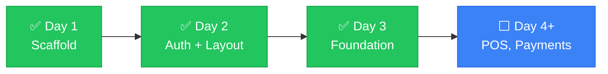

# Handover

> Write context incrementally, in a file the AI reads at the start of every session. Not a dump of everything — a living record of where things stand right now.

---

## 📌 Current State

| | |
|---|---|
| **Project** | ScanPay — Nepal payment gateway integration platform |
| **Framework** | Next.js 14 (App Router, TypeScript strict mode) |
| **Status** | ✅ Day 2 & 3 complete — auth, responsive layout, Zod validators, types, VAT/Nepali date utils |
| **Last commit** | `0a8e9fc` on `main` (Day 1 scaffold) |
| **Pending** | Day 2 & 3 changes uncommitted — user will verify and commit manually |
| **CI** | `tsc --noEmit` ✅ · `next lint` ✅ · `next build` ✅ |

---

## ✅ Completed (Day 1)

- [x] Next.js 14 project scaffolded with App Router
- [x] TypeScript strict mode configured
- [x] Tailwind CSS + Shadcn UI theme initialized (custom breakpoints: sm 414px, md 640px, lg 1024px, xl 1280px)
- [x] Folder structure created per specification
- [x] Config files: package.json, tsconfig.json, next.config.js, tailwind.config.ts, postcss.config.mjs, .eslintrc.js
- [x] `.env.local.example` with all 12 required environment variables
- [x] `.gitignore` configured (excludes `.env.local`, `.env*.local`, `node_modules`, `.next`, `*.tsbuildinfo`)
- [x] CI pipeline (`.github/workflows/ci.yml`) — typecheck, lint, build (verified passing locally)
- [x] `docs/ai-collab/` folder with 8 documentation files (README, HANDOVER, DECISIONS, FLOW, ARCHITECTURE, CONSTRAINTS, TEST_CHECKLIST, ROLLBACK)
- [x] `docs/supabase-setup.md` — Supabase project + schema + RLS verification guide
- [x] `project_docs.md` — Day 1 documentation at repo root
- [x] Dependencies installed (518 packages, lockfile in sync)
- [x] Core app files: `layout.tsx`, `page.tsx`, `globals.css`, `query-provider.tsx`
- [x] Supabase client (`src/lib/supabase/client.ts`) + admin client (`src/lib/supabase/admin.ts`)
- [x] Query provider wired into root layout
- [x] Placeholder route pages for all (auth), (dashboard), slip/[id], and API routes
- [x] Placeholder `index.ts` files in all required component folders
- [x] `public/fonts/` folder with manifest
- [x] `npm run typecheck`, `npm run lint`, `npm run build`, `npm run dev` all pass

## ✅ Completed (Day 2 — Auth + Responsive Layout Shell)

- [x] Installed `@supabase/ssr@0.5.2` for cookie-based server client
- [x] `src/lib/supabase/client.ts` — `createBrowserClient` using `@supabase/ssr`
- [x] `src/lib/supabase/server.ts` — `createServerClient` with Next.js cookie handling
- [x] `src/lib/supabase/middleware.ts` — `updateSession` helper for route protection
- [x] `middleware.ts` — protects all dashboard routes, allows `/login` and `/slip/[id]` without auth
- [x] `src/app/(auth)/login/page.tsx` — email + password login with RHF + Zod validation
- [x] `src/store/authStore.ts` — Zustand store for cashier auth state
- [x] `src/app/(dashboard)/layout.tsx` — responsive layout shell (mobile: header + bottom nav, desktop: 240px sidebar)
- [x] Framer Motion page transitions (0.2s opacity fade)
- [x] Lucide icons: ShoppingCart, Package, Archive, Users, BarChart2, Settings

## ✅ Completed (Day 3 — Foundation Layer)

- [x] `src/app/providers.tsx` — TanStack Query provider with 5-minute staleTime
- [x] `src/validators/product.schema.ts` — ProductSchema, CreateProductSchema, UpdateProductSchema
- [x] `src/validators/transaction.schema.ts` — TransactionSchema, CreateTransactionSchema
- [x] `src/validators/split.schema.ts` — SplitSessionSchema, SplitParticipantSchema, CreateSplitSchema
- [x] `src/validators/index.ts` — re-exports + backward-compatible aliases
- [x] `src/types/product.ts` — Product, ProductWithLowStock interfaces
- [x] `src/types/transaction.ts` — Transaction, TransactionWithItems, TransactionItem
- [x] `src/types/split.ts` — SplitParticipant, SplitSession, SplitType, SplitSessionWithParticipants
- [x] `src/types/slip.ts` — SlipData, SlipItem interfaces
- [x] `src/components/ErrorBoundary.tsx` — class component with retry button
- [x] `src/lib/vat.ts` — VAT_RATE, calculateVAT, calculateTotal, formatCurrency
- [x] `src/lib/nepali-date.ts` — NepaliDate class + convertToBS, formatToBS, formatToBSLong

## ⬜ Not Yet Started

- [ ] Set up Supabase project and run migrations (see `docs/supabase-setup.md`)
- [ ] Build POS dashboard components
- [ ] Implement payment gateway integrations (eSewa, Khalti, FonePay)
- [ ] Build split-bill feature
- [ ] Implement transaction and slip generation
- [ ] Product, inventory, reports, and admin pages
- [ ] Connect login to actual Supabase auth backend (requires configured Supabase project)

## 🚫 Blockers

- **None**

## 👣 Next Steps

1. Verify and commit Day 2 & 3 changes (user will do manually)
2. Configure Supabase project and create tables (`products`, `transactions`, `split_sessions`, `split_participants`)
3. Test login flow with real Supabase auth
4. Build core POS interface with payment integration

## ❓ Open Questions

- Supabase project configuration pending — need actual `NEXT_PUBLIC_SUPABASE_URL` and `NEXT_PUBLIC_SUPABASE_ANON_KEY`
- Payment gateway credentials needed for eSewa, Khalti, FonePay integration

---

> 💡 **Session handoff ritual**: End every session with a five-line note: what we did, what's left, what to watch out for. Takes 30 seconds. Saves the next session from starting cold.