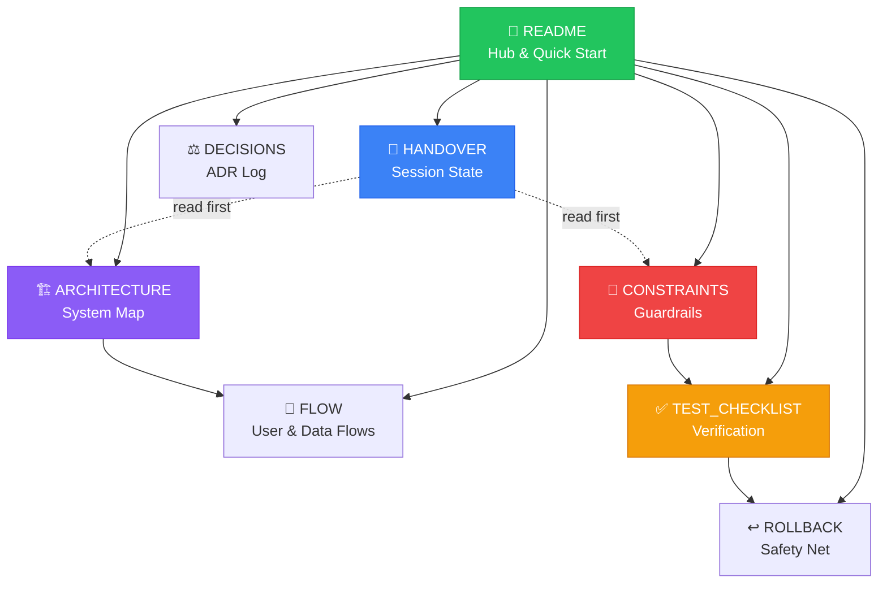

# ScanPay — AI Collaboration Hub

[](https://github.com/nij22370/scanpay/actions)
[](https://www.typescriptlang.org/)
[](https://nextjs.org/)
[](./HANDOVER.md)

> Welcome to the ScanPay AI-collaboration workspace. This directory contains **living documentation** that AI agents and human collaborators use to understand, build, and maintain the ScanPay platform — Nepal payment gateway integration (eSewa, Khalti, FonePay).

---

## 🗺️ Documentation Map



---

## 📂 Files

| # | File | Purpose | Read When |
|---|------|---------|-----------|
| 1 | `README.md` | Overview, quick start, and how to use this docs folder | You're new here |
| 2 | `HANDOVER.md` | Context for switching between collaborators / shifts | **Start every session** |
| 3 | `DECISIONS.md` | Architecture and design decisions (ADR-style) | Introducing a new pattern |
| 4 | `FLOW.md` | User flows and data flows | Modifying user-facing features |
| 5 | `ARCHITECTURE.md` | System architecture, layers, and patterns | Modifying routes, models, or layers |
| 6 | `CONSTRAINTS.md` | Hard constraints, coding rules, and guardrails | **Before writing any code** |
| 7 | `TEST_CHECKLIST.md` | Test scenarios and verification checklist | Claiming a change is "done" |
| 8 | `ROLLBACK.md` | Rollback procedures and incident response | Something breaks |

---

## 🚀 How to Use

### For AI Agents
```yaml
session_start:
  1. Read HANDOVER.md          # where things stand right now
  2. Read CONSTRAINTS.md       # what's off-limits
  3. Read ARCHITECTURE.md      # the system map
  4. Read the relevant area of FLOW.md     # execution paths
  5. State your plan in plain terms before writing code

session_end:
  - Update HANDOVER.md         # 5-line summary
  - Log decisions in DECISIONS.md
  - Trace bugs/features in Bug.md / Feature.md
```

### For Developers
1. **Check `DECISIONS.md`** before introducing new patterns — it shows *why* things are the way they are.
2. **Check `FLOW.md`** when modifying user-facing features — it traces execution between files.
3. **Update `HANDOVER.md`** at the end of each work session with current state, blockers, and next steps.
4. **Follow `ROLLBACK.md`** for safe rollback steps if something breaks.

---

## ✅ Contributing

- **Update the relevant file** whenever you make a significant change.
- **Never delete or empty a file** — append or revise in place.
- **Keep all files in sync** with the actual codebase.
- **One logical change per request** — small diffs are reviewable; big ones are gambling.
- **Read the diff, every time** — never accept a change based on a summary.

---

> 💡 **Tip**: This hub is your paper trail. Every "Allow" click should leave a trace here — in `DECISIONS.md` (the *why*), `HANDOVER.md` (the *where*), and `FLOW.md` (the *how*).