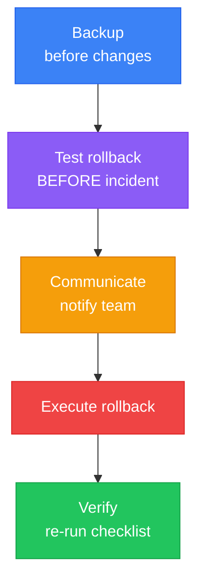
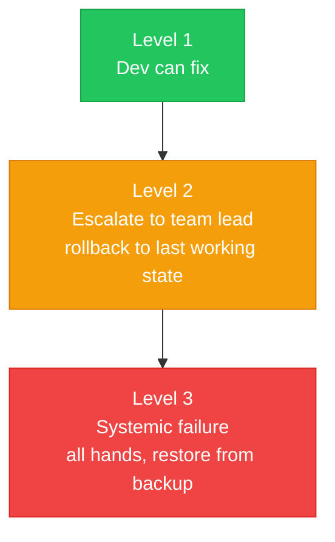

# Rollback Procedures

> A short plan for undoing a change if it breaks something — especially for large or risky edits. Which commit to revert to, which files to restore, what to re-check after.

---

## 🛡️ General Principles



1. ⚠️ **Always create a backup** before making destructive changes.
2. 🧪 **Rollback steps should be tested and documented** BEFORE an incident occurs.
3. 📢 **Communication**: notify team in `#scanpay-dev` channel when rolling back.

---

## 💻 Application Rollback (Code)

### Quick Rollback
```bash
# Revert to last known good commit
git log --oneline -5
git revert <bad-commit-hash> --no-edit
git push origin main
```

### Full Rollback via CI
```bash
# 1. Identify last working commit
git log --oneline main

# 2. Reset to last working commit (WARNING: destructive)
git reset --hard <last-good-commit>

# 3. Force push to redeploy
git push origin main --force
```

### 🚦 CI Gate
- If CI pipeline fails at `npx tsc --noEmit` → code cannot merge; fix TypeScript errors first.
- If CI fails at `npm run build` → investigate build errors; do NOT force-deploy.

---

## 🗄️ Database Rollback (Supabase)

### Migration Rollback
```sql
-- Drop a table (recreate from backup)
DROP TABLE IF EXISTS split_participants;
-- Recreate from migration SQL
-- (use SQL from migration file in version control)
```

### Data Recovery
```sql
-- If data was accidentally deleted, restore from Supabase dashboard backup
-- or use point-in-time recovery (if enabled on Supabase project)
```

### ⚠️ Emergency: Disable RLS (temporary only)
```sql
-- ONLY for emergency access, re-enable immediately after
ALTER TABLE products DISABLE ROW LEVEL SECURITY;
-- ... fix issue ...
ALTER TABLE products ENABLE ROW LEVEL SECURITY;
```

> 🔴 **Warning**: Disabling RLS exposes all table data. Re-enable as soon as the emergency is resolved.

---

## 💰 Payment Gateway Rollback

### Disable a Payment Provider
1. Remove provider route from `src/app/api/payments/{provider}/`
2. Remove provider option from UI payment method selector
3. Update environment variables (set provider flag to false)
4. Deploy via CI

### Revert Payment Verification Logic
1. Restore previous verification function from git
2. Verify signature validation was not bypassed
3. Test with sandbox credentials before redeploying

---

## ✅ Rollback Verification

After any rollback:
- [ ] CI pipeline passes (typecheck → lint → build)
- [ ] Login works
- [ ] POS page loads products
- [ ] At least one payment method works end-to-end
- [ ] Database queries return expected data
- [ ] No console errors in browser

---

## 🚨 Incident Escalation



| Level | Description | Action |
|-------|-------------|--------|
| **1** | Dev can fix | Document in `HANDOVER.md`, fix within 1 hour |
| **2** | Dev cannot fix | Escalate to team lead, rollback to last working state |
| **3** | Systemic failure | All hands, restore from backup, investigate root cause |

---

> 💡 **Why this matters**: Confidence to let AI make bigger changes comes from knowing exactly how to reverse them if they go wrong.