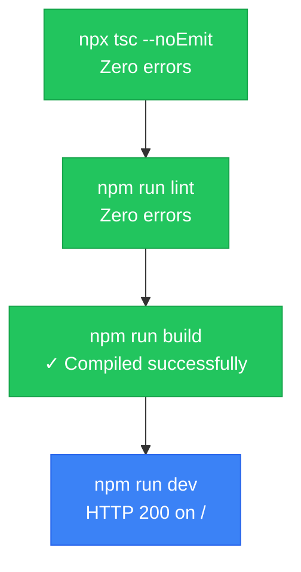

# Test Checklist

> A concrete list of what to run and check before any change counts as "done." Not a vibe check — actual commands, actual expected outputs.

---

## 🧪 Verification Gates

| Gate | Command | Expected |
|------|---------|----------|
| Typecheck | `npx tsc --noEmit` | Zero errors, exit 0 |
| Lint | `npm run lint` | Zero `Error:` lines, exit 0 |
| Build | `npm run build` | `✓ Compiled successfully`, exit 0 |
| Dev | `npm run dev` | `Ready in Xs`, `GET / 200` |

---

## 🔐 Authentication
- [ ] Login page renders with form
- [ ] Login form validates email/password (Zod schema)
- [ ] Invalid credentials show error message
- [ ] Successful login redirects to POS dashboard
- [ ] Unauthenticated user cannot access dashboard routes
- [ ] Logout clears session and redirects to login

## 💳 POS Module
- [ ] POS page displays product list
- [ ] Adding product to cart updates Zustand store
- [ ] Cart total calculates correctly (including tax if applicable)
- [ ] Remove item from cart updates total
- [ ] Quantity adjustment works correctly
- [ ] Empty cart state displays correctly

## 💰 Payment Integration — eSewa
- [x] eSewa initiate API returns valid payment URL (verified: 200 response with gatewayUrl)
- [x] Redirect to eSewa gateway works (verified: 302 redirect to rc-epay.esewa.com.np/epay?bookingId=...)
- [x] eSewa verify API validates signature (implemented: base64 decode + HMAC-SHA256 verification)
- [x] Successful payment updates transaction status (implemented: status → "completed", redirect to /slip/{id})
- [x] Failed payment shows appropriate error (implemented: /payment-failed page with retry button)
- [x] Timeout/edge case handling tested (polling via TanStack Query every 3s, error toasts on API failure)
- [x] V2 gateway URL used (`https://rc-esewa.com.np/api/epay/main/v2/form`, not V1)
- [x] `signed_field_names` parameter (not `signed_fields`)

## 💰 Payment Integration — Khalti
- [ ] Khalti initiate API returns valid payment URL
- [ ] Redirect to Khalti gateway works
- [ ] Khalti verify API validates signature
- [ ] Successful payment updates transaction status
- [ ] Failed payment shows appropriate error

## 💰 Payment Integration — FonePay
- [ ] FonePay initiate/verify API works correctly
- [ ] Payment status updates correctly

## ✂️ Split Bill
- [ ] Create split session with participants
- [ ] Each participant can pay their share
- [ ] Split session marked complete when all paid
- [ ] Partial payment tracked correctly
- [ ] Split report shows individual contributions

## 📄 Transactions
- [ ] Transaction created on successful payment
- [ ] Transaction status transitions: pending → completed / failed
- [ ] Transaction list filters by date, status, payment method
- [ ] Transaction detail page shows all info

## 🧾 Slip Generation
- [ ] Slip page renders at `/slip/[id]`
- [ ] PDF downloads correctly (jsPDF)
- [ ] Barcode (bwip-js) renders on slip
- [ ] QR code (qrcode) renders on slip
- [ ] All transaction details present on slip
- [ ] Nepali date displayed correctly on slip

## 📊 Reports
- [ ] Revenue report generates by date range
- [ ] Payment method breakdown report works
- [ ] Export to PDF works
- [ ] Charts render correctly

## 📦 Products
- [ ] Add product with validation (Zod)
- [ ] Edit product updates correctly
- [ ] Delete product works
- [ ] Product list filters/search works

## 📋 Inventory
- [ ] Stock levels display correctly
- [ ] Low stock alerts trigger
- [ ] Stock adjustment (add/remove) works
- [ ] Inventory linked to product stock

## 🗄️ Supabase / Database
- [ ] All 4 tables created: `products`, `transactions`, `split_sessions`, `split_participants`
- [ ] RLS enabled on all tables
- [ ] Foreign key relationships correct
- [ ] Indexes created for frequent queries
- [ ] Service role key only used server-side

## 🌍 Environment
- [ ] `.env.local.example` has all required keys
- [ ] `.env.local` is gitignored
- [ ] CI pipeline copies `.env.local.example` to `.env.local` before build
- [ ] All env vars accessible where needed

---

> 💡 **Why this matters**: AI claiming success and code actually working are two different facts. This file is how you stop confusing them.